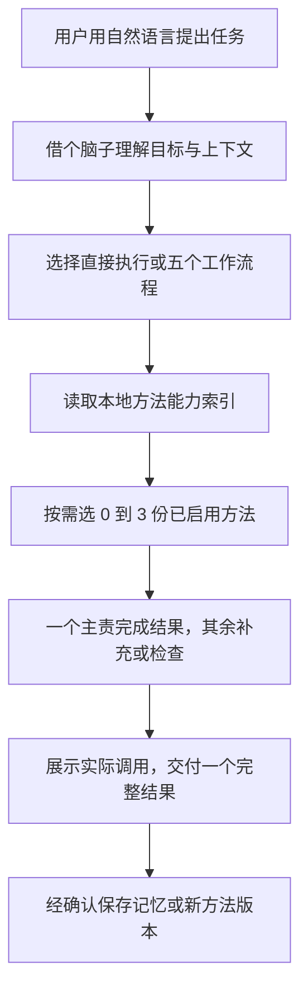

# 借个脑子：整体机制

本设计服务于“说自己的事，AI 自动找到合适的方法并完成结果”。用户无需理解路由、上下文或插件。

## 五个入口

| 名称 | 命令 | 主要责任 |
| --- | --- | --- |
| 借个脑子 | `$bab` | 理解意图、选流程、选方法、整合结果 |
| 借个高手 | `$bab-pro` | 蒸馏别人或主题的方法；使用已有方法协作 |
| 懂我一点 | `$bab-me` | 从获准记录找规律，维护可确认的个人记忆 |
| 问到点上 | `$bab-ask` | 每轮问关键问题，给推荐与理由，推进到行动 |
| 带我上手 | `$bab-help` | 演示、安装、更新、反馈、查看与删除数据 |

中文指令和案例是当前主版本。命令、程序字段和接口用英文。英文显示名不改变调用命令。

## 三层职责



1. **Skill 层**教 AI 怎么判断、提问、提炼和协作。依赖宿主模型理解，不用关键词假装语义路由。
2. **本地内核**负责目录、授权范围、状态、版本、校验和操作回执。脚本不自行调用付费模型，不上传原始聊天。
3. **宿主层**负责模型、工具、会话和真正的代理执行。当前使用已有 Agent。DeepSeek Harness 是可选适配方向，见 [核查与取舍](deepseek-harness.md)。

AGENTS 规则要求新会话先读总入口，再按每轮意图分流；它不是强制执行钩子。已开展 Codex 新会话实测，见 [独立验收](independent-evaluation.md)。换宿主仍需复测。具备事件钩子的宿主才能在运行层强制记录每轮调用情况。

## 人物档案怎么存

代码与用户资料分离。下方是用户数据目录的真实布局规则，编号由程序生成，不使用人名作文件路径：

```text
borrow-a-brain 用户数据目录/
├── state.json                     # 唯一索引：人物、别名、当前版本、记忆、授权、任务分工
├── author.json                    # 可选：本地覆盖的官网、更新和反馈地址
├── materials/                    # 分类素材库：每项仅保留当前副本
└── people/
    └── 每个人的独立编号/
        └── versions/
            ├── v0001/
            │   ├── record.json    # 来源索引、必要摘录、方法、边界、测试记录
            │   └── SKILL.md       # 可按需读取的执行说明
            └── v0002/
                ├── record.json
                └── SKILL.md
```

`state.json` 的人物索引决定哪个版本生效，不另外保存一份可能不同步的“current”副本。当前分析默认不留文件。用户明确要求收集时，素材库另存一份当前副本，更新替换旧副本，原文件不动；每个方法版本只记录必要证据。来源关联素材 id、revision 和哈希，变化时派生待复核状态，不重写旧档案。目录独立，但不是系统加密保险箱。应沿用用户账户权限和设备保护措施。

人物档案、主题方法、自我方法使用同一版本机制。个人偏好保存在独立规则集合，避免把一位同事的偏好混成用户自己的偏好。

## 蒸馏一个同事之后

以虚构人物“老王”为例：

1. 用户指定可用材料和用途，例如学习项目延期沟通方法。
2. AI 提炼判断信号、行动顺序、取舍和例外，每条关联证据。
3. 保存草稿版本。用一个新问题和一个不适用问题试用，记录输出与评审方式。
4. 用户审阅后启用。以后可说“按老王的方法改改”，也可由系统根据任务自动选中。
5. 有新材料或纠正，创建新草稿，展示变化。确认后切换版本；可以回到明确的旧版本。
6. 需要跨应用时导出独立 Skill。先预览正文，确认后写入新目录；不带原始记录和来源路径。导出副本不自动同步。

“用户确认可用”不代表被蒸馏的人认可了这些推断。产物始终描述为基于有限材料的方法，而不是本人意见或完整人格。

## 自动选择与多个专家

能力索引包含擅长任务、适用场景和禁用条件。先读索引，再加载选中方法的具体版本。默认最多三份：一个主责，最多两个补充或检查者。

例如用户只说“帮我跟客户解释延期”，模型可以自动选择老王的方法组织结构，再用小李的方法检查语气。二人意见冲突时，根据任务目标和事实判断，不能靠多数投票。

路由记录保留选择理由、分工和精确版本。同一任务续聊复用版本；目标改变才重新选用。新会话可先查同范围的任务摘要，再恢复；获准后保存最小结果与下一步。用户排除的方法不得被选入。没有合适专家就正常回答，不编造专家。

当前内核支持方法分工与版本恢复。真正的语义选择由宿主模型完成。默认同一个 Agent 按顺序使用方法；并行子代理需要宿主支持与授权，不能把“参考三份方法”报成“三位代理独立评审”。

## 自我蒸馏与记忆

历史读取先发现环境再确认范围。默认最近 10 个，单次最多 20 个。只读获准目录；在当前适配器里按文件修改时间排序，不能宣称等同于界面最近会话。大文件、异常记录和子代理排除情况要披露。

观察、候选规律、已确认规则分开。用户说过什么、AI 建议过什么、用户真正做了什么、结果如何分开记录。检索默认只使用相关范围内的确认项。

纠正形成新规则，旧规则标记被替代。忘记一条规则时清除整个修订链，避免旧版本重新出现。人物删除清除该档案所有版本和任务引用。清空派生数据包括受管理素材副本，不会删除宿主原始聊天或服务端已发送反馈。

## 使用体验与维护

首次使用先完成一件小事。进入历史读取、持久保存或外发反馈时，再解释对应权限。推荐选项必须带一句具体理由；信息够用就交付。

小惊喜有三类：引用用户过去确认过的判断、换一个适用视角、把验证有效的方法留下。作者资源需真实相关，14 天冷却且可关闭；没有配置可用地址就不展示。

反馈由明确纠正触发建议，同一任务同一问题三次后只提一次。正文区分事实与根因猜测。用户审阅接收地址和正文后才发出。官网私有收件箱已接通认证后台 API，可处理状态并返回修复版本。

更新默认在再次使用时按 7 天间隔检查。来源可配置多个 HTTPS 地址，校验同一个作者签名。用户同意版本后替换代码，保留数据。官网迁移需要长期入口与备用源；离线用户仍能使用已有版本。

## 质量验收

- 自动化测试验证存储、范围、版本、删除、安装回滚、更新签名、反馈接口和多方法分工约束。
- 场景评测验证自然表达是否选对流程、推荐是否有用、什么时候不调用专家，以及是否能在新会话找回方法。
- 五位普通用户的上手测试尚未完成，不能用脚本测试代替。
- 官网说明页应沿用官网组件与排版，单独进行移动端和真实应用验收。本仓库不将旧样稿当作最终网页。
